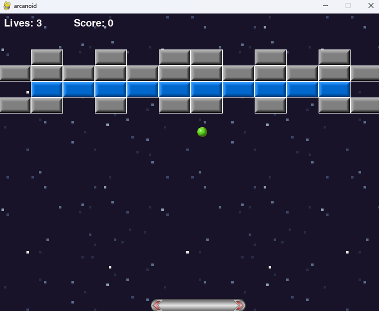

### Pygame Arcanoid ###
\
Simple 2D game with 4 levels
### Running project locally ###
1. Make sure you have downloaded and configured python and pip
```bash
py --version
pip --version
```

2. Create virtual environment
```bash
py -m venv .venv
.venv\Scripts\activate
```

3. After downloading and unpacking project in the root folder run:
```bash
pip install -r requirements.txt
```

4. To start game run:
```bash
py main.py
```